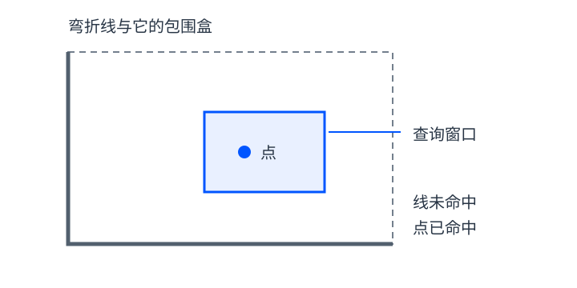

## 从“全部检查”到“先找候选”

假设一个图层保存了大量地块，要找出与某个查询窗口相交的对象。最直接的方法是逐个执行几何判断，但很多对象远在窗口之外，做精确计算并没有必要。

空间索引把对象按位置组织起来，让查询先排除一批不可能命中的对象，再对剩余候选执行更精确的判断。它通常减少工作量，不会改变查询希望得到的几何关系。

## 包围盒相交，不等于对象相交

包围盒是能够包含对象的矩形范围。判断两个矩形是否重叠，比处理复杂线或多边形容易，因此适合作为第一轮筛选。

图为本文自行绘制的概念示意，不使用真实地理数据。灰色弯折线的虚线包围盒与蓝色窗口重叠，但线本身没有碰到窗口。第一轮筛选会保留它，精确判断才将它排除；窗口里的实心点则是真正命中。

这类“候选命中但最终不命中”不是索引失效，而是粗筛选允许的情况。重要的是不能漏掉真正满足条件的对象。

PostGIS 的 [Spatial Indexing 教程](https://postgis.net/workshops/postgis-intro/indexing.html) 用包围盒筛选与精确判断解释空间查询，并说明了相关索引与查询函数的配合。

## 几种结构各自组织什么

| 结构 | 可以怎样理解 | 不应忽略的条件 |
| --- | --- | --- |
| k-d 树 | 按坐标维度逐层划分点集 | 查询窗口跨过分割线时，两侧都可能有结果 |
| 四叉树 | 递归把二维区域分成四部分 | 跨多个区域的对象需要明确存储和查询规则 |
| R 树 | 将对象包围盒分组并形成层级 | 不同分组的包围盒可能重叠，需继续查找候选 |

这些结构不应混成“同一种树”。学习时先理解组织对象和剪枝的方式，再看具体软件采用什么实现。

在一种将矢量对象存到“能容纳它的最小四叉树节点”的组织方式中，大对象可能存于较高层节点。查询不能只看窗口对应节点的后代，还需要检查可能覆盖窗口的祖先对象。规则取决于具体实现，不能只凭图上有四个象限就推断算法完整。

## 为什么建立索引后仍可能不快

如果查询窗口几乎覆盖整个图层，大多数对象都是候选，就没有多少内容可排除。即使查找很快，返回大量结果本身仍然需要时间。

复杂对象的包围盒很大或互相重叠很多时，粗筛选也可能留下大量误命中。除此之外，建索引、更新索引、读取数据都有成本，是否值得使用要结合查询方式和数据规模判断。

因此，“存在索引”不能代替实际测量。比较性能时，应使用同一数据、同一查询与一致环境，并核对结果是否相同；没有做过这种对比，就不应宣称某个加速倍数。

## 记住两个步骤

先用索引找候选，再用几何关系确认答案。返回候选数量与最终命中数量的差别，有助于理解索引到底节省了什么工作。

本文根据个人 Obsidian《第08章 空间索引》整理，原学习材料参考 Stephen Wise《GIS数据结构与算法基础》；R 树与数据库查询部分补充参考 PostGIS 官方教程。本文为学习笔记，不包含数据库性能实测。
